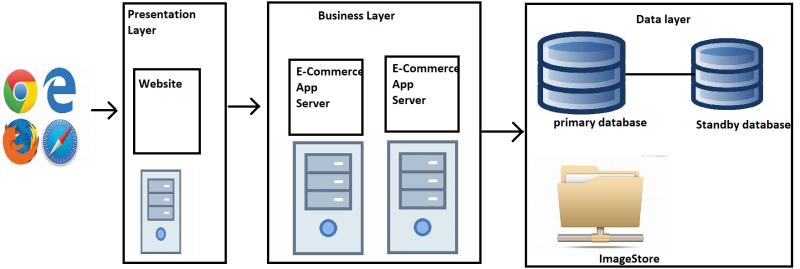
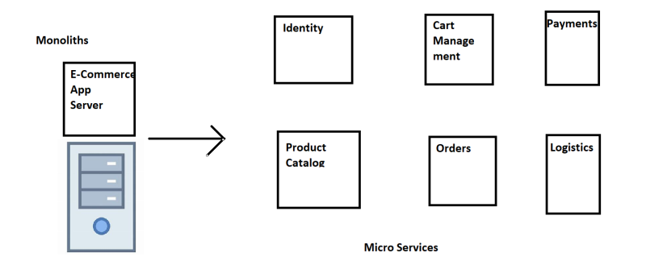
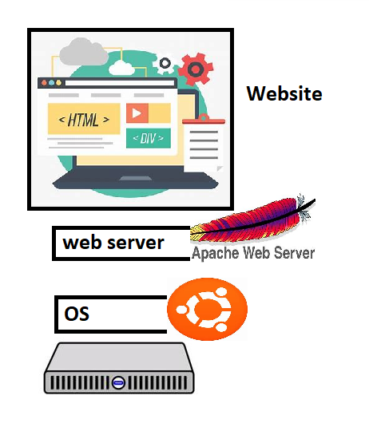
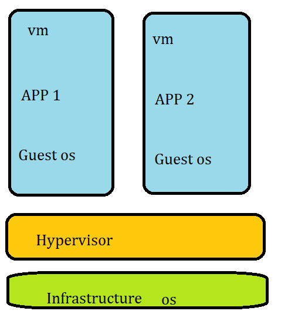
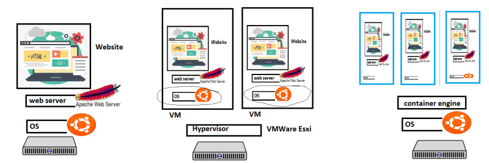

# Docker
### ABOUT Docker, Architecture, Containers
#### History
##### General problems before Docker
* normal architecture for monolithic is
  
  * servers for presentation layer
  * servers for business layer
  * database servers
* with above architecture we have following problems
  * we cannot run for different frond ends (ex:ios,andriod)
    * Accesibility
    * Cross platform
  * when we want Deploy new features - more downtimes
  * if we want to run on any cloud, will not support for all- portability
  * if we want to decompose the application into smaller services - flexbilty
  * if we want to update independent micro servics
  * comapared to monolith- re using ,updating,scaling micro service is simpler and cost effective
  
* To achieve above best solution 
  * Container Technology - Docker
  * Container orchestration - Kubernetes 
##### Evolution
* Gen-1 : Directly from Physical servers
  * running application directly on physical server
  * if your application not utilizing complete hardware - ROI is long
  
* Gen-2 : Using Hypervisor creating vms and applications run on vms
  * Hypervisor perform Hardware virtualization and provides
      * vir-cpu
      * vir-ram
      * vir-disk
      * vir-network
  * In the isolated area created by hypervisior, we can install os & necces softwares
  * Application can be installed and run from there
  * Better ROI
  
* Gen-3 : Containers - are isolated areas which has vir-os ,looks like vms
  
### Docker
* Docker is software used to create containers
* Docker is a open platform to develop,shipping and for running applications
* Docker enablse you to seperate your application with your infra, so that you deliver software quickly
* 

