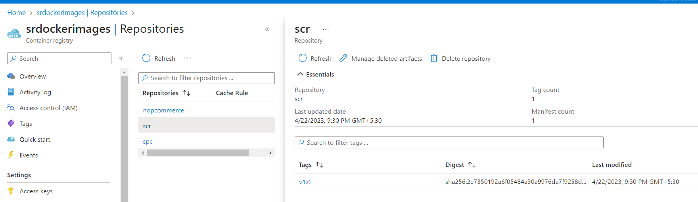

JOIP-DATED-21-04-2023
---------------------

#### **nop Commerce Application**
1. **Mutli Stage Docker file**
* Normal steps 
* Installing neccessary prequisties like
  * unzip (apt)
  * dotnet 7 (will take from image)
* here we have download a zip file from url and extract it and then run dll command , which will make our image bulk
* so if we wanted make in 2 stage i.e 
   1. downloading zip file and extracting 
   2. copy the extracted folder and run application
* so here we can use multi satge docker file
```Dockerfile
FROM ubuntu:22.04 AS extractor
ADD https://github.com/nopSolutions/nopCommerce/releases/download/release-4.60.2/nopCommerce_4.60.2_NoSource_linux_x64.zip /nopCommerce/nopCommerce_4.60.2_NoSource_linux_x64.zip
RUN apt update && apt install unzip -y 
RUN cd /nopCommerce && unzip nopCommerce_4.60.2_NoSource_linux_x64.zip && \
mkdir bin logs && rm nopCommerce_4.60.2_NoSource_linux_x64.zip 

FROM mcr.microsoft.com/dotnet/sdk:7.0
LABEL author="srikanth" org="qt" project="multistage-nop"
ARG user=nopCommerce
ARG group=nopCommerce
ARG HOME_DIR=/nopCommerce
ARG uid=1000
ARG gid=1000
RUN groupadd -g ${gid} ${group} \
   && useradd -d "$HOME_DIR" -u ${uid} -g ${gid} -m -s /bin/bash ${user}
WORKDIR ${HOME_DIR}
EXPOSE 5000
ENV ASPNETCORE_URLS="http://0.0.0.0:5000"
COPY --from=extractor /nopCommerce ${HOME_DIR}
CMD [ "/usr/bin/dotnet","/nopCommerce/Nop.Web.dll" ]
```


2. **Pushing to Docker image**
```
docker image tag nopmulti:v1.0 srikanthvelma/nopcommerce:v1.0
docker image push srikanthvelma/nopcommerce:v1.0
```


1. **Pusing to Azure Container Registry**
* for container registry creation and pushing [refer][https://learn.microsoft.com/en-us/azure/container-registry/container-registry-get-started-portal?tabs=azure-cli]


```
az login
az acr login --name srdockerimages
docker login srdockerimages.azurecr.io

docker image tag srikanthvelma/nopcommerce:v1.0 srdockerimages.azurecr.io/nopcommerce:v1.0

docker image push srdockerimages.azurecr.io/nopcommerce:v1.0
```
* here faced a issue with authorization and region
* created access keys and given username and password from access keys
* created in the region of `East US`, with region `central india` error came


4. **Docker Compose File - nopCommerce**
```yaml
---
version: '3.9'
services:
  nop:
    build:
      context: .
      dockerfile: Dockerfile
    container_name: nopsql
    environment:
      - MYSQL_SERVER=mysql
    networks:
      - nop-bridge
    ports:
      - "32000:5000"
    depends_on:
      - mysql
  mysql:
    image: mysql:8
    container_name: mysql
    environment:
      - MYSQL_ROOT_PASSWORD=password
      - MYSQL_USER=qtuser
      - MYSQL_PASSWORD=srikanth57
      - MYSQL_DATABASE=test
    networks:
      - nop-bridge
    volumes:
      - type: volume
        source: mysqlvol
        target: /var/lib/mysql
networks:
  nop-bridge:
    name: nop-bridge
    driver: bridge
    ipam:
      config:
        - subnet: "10.0.0.0/24"
volumes:
  mysqlvol:
    name: mysqlvol       
```
```sh
docker compose up -d
docker compose down # if u want to down conatiners
```


#### **spring-petclinc Application**
1. **Multi Stage Docker file**
* Pre-requisites
  * java-17
  * maven -3.6
* Manual Steps
```
git clone https://github.com/spring-projects/spring-petclinic.git
cd spring-petclinc
mvn package
java -jar spring-petclinic.jar
```
```Dockerfile
FROM alpine/git AS VCS
RUN cd / && git clone https://github.com/spring-projects/spring-petclinic.git 

FROM maven:3.9-amazoncorretto-17 AS Builder
COPY --from=VCS /spring-petclinic /spring-petclinic
RUN cd /spring-petclinic && mvn package

FROM amazoncorretto:17-alpine-jdk
LABEL author="srikanth" org="qt" project="multistage-spc"
ARG HOME_DIR=/spring-petclinic
WORKDIR ${HOME_DIR}
COPY --from=Builder /spring-petclinic/target/spring-*.jar ${HOME_DIR}/spring-petclinc.jar
EXPOSE 8080
CMD [ "java","-jar","spring-petclinc.jar" ]
```


2. **Pushed to docker hub**
```
docker image tag spcmulti:v1.0 srikanthvelma/spc:v1.0
docker image push srikanthvelma/spc:v1.0
```

3. **Pushed to Azure ACR**
```
az login
az acr login --name srdockerimages
docker login srdockerimages.azurecr.io

docker image tag srikanthvelma/spc:v1.0 srdockerimages.azurecr.io/spc:v1.0

docker image push srdockerimages.azurecr.io/spc:v1.0
```


1. **Docker-Compose File for SPC**
```yaml
---
version: '3.9'
services:
  spc:
    build:
      context: .
      dockerfile: Dockerfile
    container_name: spc
    ports:
      - 32500:8080
    
```


#### **Students Courses Register RestAPI**
* Pre-requisites
  * python3 and pip
* Manual Steps
```
git clone https://github.com/DevProjectsForDevOps/StudentCoursesRestAPI.git
cd StudentCoursesRestAPT
pip install -r requirements.txt
python app.py
```
1. **Multi Stage Dockerfile**
```Dockerfile
FROM alpine/git AS VCS
RUN cd / && git clone https://github.com/DevProjectsForDevOps/StudentCoursesRestAPI.git

FROM python:3.8-alpine
LABEL LABEL author="srikanth" org="qt" project="multistage-scr"
ARG HOME_DIR=/StudentCoursesRestAPI
ENV MYSQL_ROOT_PASSWORD=password
ENV MYSQL_USER=qtuser
ENV MYSQL_PASSWORD=srikanth
ENV MYSQL_SERVER='local host'
ENV MYSQL_PORT=3306
COPY --from=VCS /StudentCoursesRestAPI ${HOME_DIR}
WORKDIR ${HOME_DIR}
RUN pip install -r requirements.txt
EXPOSE 8080
CMD [ "python","app.py" ]
```
* Docker image build and Container run
```
docker image build -t scrmulti:v1.0 .
docker container run -d -P --name scrmulti scrmulti:v1.0
```


2. **Pushed to docker hub**
```
docker login
docker image tag scrmulti:v1.0 srikanthvelma/scr:v1.0
docker image push srikanthvelma/scr:v1.0
```

3. **Pushed to Azure ACR**
* already login to docker and acr -refer above to login procedure in spc
* as i build image in docker playground..didnot signed in ACR in that machine 
* so pulling image from docker hub 
```
docker image pull srikanthvelma/scr:v1.0
docker image tag srikanthvelma/scr:v1.0 srdockerimages.azurecr.io/scr:v1.0
docker image push srdockerimages.azurecr.io/scr:v1.0 
```



4. **Docker-Compose File For SCR**
```yaml
---
version: '3.9'
services:
  scr:
    build:
      context: .
      dockerfile: Dockerfile
    container_name: scrmulti
    networks:
      - scr-bridge
    environment:
      - MYSQL_SERVER=mysqlscr  
    ports:
      - 33500:8080
    depends_on:
      - mysql
  mysql:
    image: mysql:8
    container_name: mysqlscr
    networks:
      - scr-bridge
    volumes:
      - type: volume
        source: mysqlscr-vol
        target: /var/lib/mysql
    environment:
      - MYSQL_ROOT_PASSWORD=password
      - MYSQL_USER=qtuser
      - MYSQL_PASSWORD=srikanth
      - MYSQL_DATABASE=test
networks:
  scr-bridge:
    name: scr-bridge
    driver: bridge
    ipam:
      config:
        - subnet: "10.0.0.0/24"
volumes:
  mysqlscr-vol:
    name: mysqlscr-vol
```
```
docker compose up -d
docker compose down #if u want to down the containers
```


