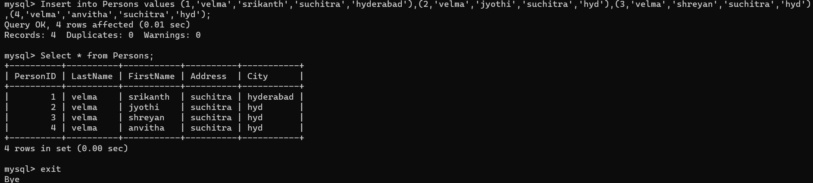
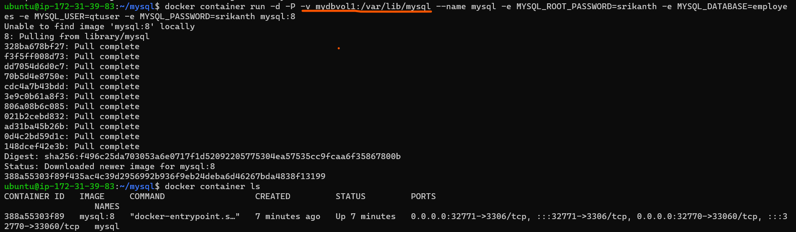
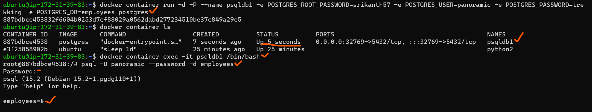

14-04-20223
-----------
1. Run hello-world docker container  and observe the container status
* ` docker container run -d --name helloworld hello-world`
* `docker container ls`
* `docker container ls -a`

* status is container is not running
  
2. Check the docker images and also write down the size of hello-world image
* `docker image ls`

3. Run the nginx container with name as nginx1 and expose it on 8080 port on docker host
* `docker container run -d -p 8080:80 --name nginx1 nginx`


4. Explain docker container lifecycle
* There are different stages in docker, when we create docker contianers, which is known as Docker container lifecycle
* The stages are
  * **Created**
  * **Running**
  * **Paused**
  * **Stopped**
  * **Deleted** 

#### Create Containers
* using `docker container create` command will create a container with specified `docker image`
* `docker container create --name <container name> <imagename>:<tag>`

* here if we observe `create` command only creates container ,it will not run the container
* if we run `docker container ls` it will not be shown.
* if we run `docker container ls -a` then only it will be shown.
* status : is created , not running
#### Start Containers
* using `docker container start` command we will start the already created container
* `docker container start <container name>`

* here the status of container is up and running
* if we run `docker container ls` it will shown
#### Run Containers
* using `docker container run` command will do work of both `create` and `start` commands
* it will create container and also up and running
* `docker container run -d -P --name <container name> <image name>:<tag>`

* so by using run command : it will create and start the container
#### Pause Containers
* using `docker container pause` command ,we will pause the processes of container
* `docker container pause <container name>` 

* here it will pause our application loading ,but it will be visible in `docker container ls`
* now we can again run container by using `unpause`

#### Stop Container
* using `docker container stop` command we can stop the running container
* `docker container stop <container name>`

* it will completly stop container
* if we want we can again start containe by `start` command
#### Delete Container
* using `docker container rm` we can delete the containers
* `docker container rm <container name>`
* from above we can delete container which is stopped, running containers cannot be delete by this

* running conatiners can be deleted by using `force -f` option
* `docker container rm -f <container name>`
  
5. Explain what happens when you run the docker container
* when we run docker container 
  * first it will download the docker image from registry or local 
  * and then creates a docker container
  * and start that container
  * After creation of container ,it will get
    * new process tree
    * disk mount or file system
    * network -nic
    * cpu/memory
    * users

6. Explain the Docker architecture


15-04-2023
----------
1. write a Dockerfile for nodejs application 
* `https://github.com/expressjs/express`

* Manual steps 
```

```
* Dcoker file for express nodejs
```Dockerfile
FROM node:16-alpine
LABEL authour="srikanth" project="nodejs" org="qtdevops"
RUN apk add git 
RUN apk add npm
RUN git clone https://github.com/expressjs/express.git 
RUN cd express && npm install express && \
npm install -g express-generator@4 && \
express /tmp/foo && cd /tmp/foo && npm install 
EXPOSE 3000
WORKDIR /tmp/foo
CMD [ "npm", "start" ]
```
`docker run --rm --entrypoint /bin/sh <image-name> -c "<any linux command>`
ex: `docker run --rm --entrypoint /bin/sh <image-name> -c "cat /path/to/file"` to cat content
* for execution
* `docker image build -t node:v1.0.0`


16-04-2023
-----------
1. create a mysqldb container from official mysql image 
2. login into sql container and create a table
```
docker container run -d -P --name mysql -e MYSQL_ROOT_PASSWORD=srikanth -e MYSQL_DATABASE=employees \n
-e MYSQL_USER=qtuser -e MYSQL_PASSWORD=srikanth mysql:8
```

```
 docker container exec -it mysql mysql --password=srikanth

 mysql> use employees;

  CREATE TABLE Persons (
        PersonID int,
        LastName varchar(255),
        FirstName varchar(255),
        Address varchar(255),
        City varchar(255)
    );

Insert into Persons values (1,'velma','srikanth','suchitra','hyderabad'),(2,'velma','jyothi','suchitra','hyd'),(3,'velma','shreyan','suchitra','hyd'),(4,'velma','anvitha','suchitra','hyd');

Select * from Persons;
```



3. try to create a persisted volume in mysql container and mount that to other
```
docker container run -d -P -v mydbvol1:/var/lib/mysql --name mysql -e MYSQL_ROOT_PASSWORD=srikanth \n
-e MYSQL_DATABASE=employees -e MYSQL_USER=qtuser -e MYSQL_PASSWORD=srikanth mysql:8

docker volume ls
```


* now to check persisted volume i am deleting mysql container 
* and creating new one with mounting old vol to it


4. Now postgres database
```
 docker container run -d -P --name psqldb4 -e POSTGRES_ROOT_PASSWORD=srikanth57 -e POSTGRES_USER=postgres -e POSTGRES_PASSWORD=srikanth57 -e POSTGRES_DB=employees postgres
```

* got an error when we try to login with below command
* ` docker container exec -it psqldb4 postgres --password=srikanth57`
* error is 
```
"root" execution of the PostgreSQL server is not permitted.
The server must be started under an unprivileged user ID to prevent
possible system security compromise.  See the documentation for
```
* so login psql we try to login as below
```
docker container exec -it psqldb4 /bin/bash

root@4a7d3cdd1ffd:/# psql -h localhost -U postgres
```

* postgres database commands to create tables
```
postgres=# \c employees

employees=# INSERT INTO persons5 VALUES (1,'srikanth','suchitra','hyd');
employees=# SELECT * FROM persons5;
```
```
employees=# INSERT INTO persons5 VALUES (2,'jyothi','suchitra','hyd'),(3,'anvi','suchitra','hyd'),(4,'shreyan','suchitra','hyd');
employees=# SELECT * FROM persons5;
```


18-04-2023
#### 1. Create a alpine conatiner in interactive mode and install python
* `docker container run -it --name python1 alpine /bin/sh`
* `apk add --update python3`


#### 2. Create a ubuntu container with sleep 1d and then login using exec and install python
* `docker container run -d --name python2 ubuntu sleep 1d`
* `docker container ls`
* `docker container exec -it python2 /bin/bash`
* `apt update`

* `apt install python3 -y`


#### 3. Create a postgres container with username panoramic nad password as trekking .Try logging in and show the databases (query for pasql)
* `docker conainer run -d -P --name psqldb1 -e POSTGRES_ROOT_PASSWORD=srikanth57 -e POSTGRES_USER=panoramic -e POSTGRES_PASSWORD=trekking -e POSTGRES_DB=employees postgres`
* `docker container exec -it psqldb1 /bin/bash`
* `psql -U panoramic --password -d employees` in bash terminal of container, it will ask for password 



#### 4. Try to create a dockerfile which runs phpinfo page, use ARG and ENV wherever appropriate on 1.apache, 2.nginx
1. **apache**
* Manual steps
```
sudo apt update
sudo apt install apache2 -y
sudo apt install php libapache2-mod-php -y
```
```Dockerfile
FROM ubuntu:22.04
LABEL author="srikanth" org="qt" project="LAMP"
ARG DEBIAN_FRONTEND=noninteractive
RUN apt update && \
    apt install vim -y && \
    apt install apache2 -y && \
    apt install php -y && \
    apt install libapache2-mod-php -y
WORKDIR /var/www/html
COPY /info.php /var/www/html/info.php
EXPOSE 80
CMD [ "apache2ctl","-D","FOREGROUND" ]
 
```
* created info.php file in local
* `docker image build -t apache:v1.0.0 .`
* `docker container run -d -P --name apachephp2 apache:v1.0.0`


2. **nginx**
```Dockerfile
FROM ubuntu:22.04
LABEL author="srikanth" org="qt" project="LEMP"
ARG DEBIAN_FRONTEND=noninteractive
RUN apt update && \
    apt install nginx -y && \
    apt install  php php-fpm -y 
RUN mkdir /var/www/srapp 
COPY /srapp /etc/nginx/sites-available/srapp
RUN ln -s /etc/nginx/sites-available/srapp /etc/nginx/sites-enabled/ 
RUN unlink /etc/nginx/sites-enabled/default 
RUN service nginx reload
COPY /index.html /var/www/srapp/index.html
COPY /info.php /var/www/srapp/info.php
RUN service nginx reload
EXPOSE 80
#CMD [","nginx", "-g", "daemon off;"]
#CMD /etc/init.d/php7.4-fpm start -F && nginx -g "daemon off;"
CMD ["/bin/bash","-c","service php8.1-fpm restart && nginx -g 'daemon off;'"]

```
* `docker image build -t nginx:v1.0 .`
* `docker container run -d -P --name nginx nginx:v1.0`


#### 5. Create a jenkins image by craeting a own docker file
* Dockerfile for jenkins image
```Dockerfile
FROM ubuntu:22.04
LABEL author="srikanth" org="qt" project="Jenkins"
RUN apt update && apt install curl -y
RUN apt install openjdk-17-jdk -y
RUN curl -fsSL https://pkg.jenkins.io/debian/jenkins.io-2023.key | tee \
  /usr/share/keyrings/jenkins-keyring.asc > /dev/null && \
  echo deb [signed-by=/usr/share/keyrings/jenkins-keyring.asc] \
  https://pkg.jenkins.io/debian binary/ | tee \
  /etc/apt/sources.list.d/jenkins.list > /dev/null
RUN apt update && apt install jenkins -y 
USER jenkins
ENV JENKINS_HOME=/var/lib/jenkins
EXPOSE 8080
CMD [ "/usr/bin/jenkins" ]

```
* here in above file important are `USER`,`JENKINS_HOME`,
* `CMD - /usr/bin/jenkins - this is the ExecStart in jenkins.service file`
* `docker image build -t jenkins:v1.0 .`
* `docker container run -d -P --name jenkins jenkins:v1.0`
* 
* 
* 
* 

#### 6. Create nop commerce and mysql server and try to make them work by configuring
* first write a docker file for nop commerce
```Dockerfile
FROM mcr.microsoft.com/dotnet/sdk:7.0
LABEL author="srikanthvelma" org="qt" project="docker"
ADD https://github.com/nopSolutions/nopCommerce/releases/download/release-4.60.2/nopCommerce_4.60.2_NoSource_linux_x64.zip /nop/nopCommerce_4.60.2_NoSource_linux_x64.zip
WORKDIR /nop
RUN apt update && \
apt install unzip -y && \
unzip /nop/nopCommerce_4.60.2_NoSource_linux_x64.zip && \
mkdir /nop/bin && mkdir /nop/logs
EXPOSE 5000
CMD [ "dotnet", "Nop.Web.dll", "--urls", "http://0.0.0.0:5000" ]
```
* build a docker image for nop `docker image build -t nop:v1.0 .`

* To configure nop and mysql -- 
  * we have to create bridge network - mybridge
  * create mysql with vol and in above network with env variables
  * create a nop with passing MYSQL_SERVER variable passing above mysql name
* `docker network create mybridge --subnet "10.0.0.0/24"`
* ` docker container run -d --name mysql --network mybridge -v mysqlvol:/var/lib/mysql -e MYSQL_ROOT_PASSWORD=password -e MYSQL_USER=qtuser -e MYSQL_PASSWORD=srikanth57 mysql:8`
* `docker container run -d -P --name nop --network mybridge -e MYSQL_SERVER=mysql nop:v1.0`

* next open the application by port of nop and try to pass mysql server details


